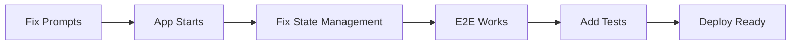

# Action Plan: Getting Reframe Agents to E2E Working State

## Goal
Enable successful end-to-end testing with `poetry run poe web` locally within 1-2 days.

## Team Assignments

### Developer 1: Prompt System (4-6 hours)
**Files to modify:**
- `app/services/prompts/langfuse_cli.py`
- Create `app/prompts/fallback_prompts.py`

**Tasks:**
1. Add fallback prompts for all 4 agents
2. Update download list to include parser prompt
3. Add error handling for Langfuse failures
4. Test that agents initialize without Langfuse

**Acceptance Criteria:**
- [ ] App starts without Langfuse connection
- [ ] All agents get valid instruction prompts
- [ ] No prompt-related errors on startup

### Developer 2: State Management (6-8 hours)
**Files to modify:**
- `app/tools/exit_loop.py`
- `app/agents/analysis_llm.py`
- Create `app/tools/save_analysis.py`

**Tasks:**
1. Update exit_loop to accept and save intake data
2. Create tool for AnalysisLLM to save analysis output
3. Add state validation in PdfAgent
4. Add debug logging for state transitions

**Acceptance Criteria:**
- [ ] state["intake_data"] populated after CollectorLoop
- [ ] state["analysis_output"] populated after AnalysisLoop
- [ ] PDF generates with complete content
- [ ] State flow visible in logs

### Developer 3: Testing & Documentation (4-6 hours)
**Files to create:**
- `tests/fixtures/example_conversations.json`
- `tests/integration/test_e2e_flow.py`
- `docs/TESTING_GUIDE.md`

**Tasks:**
1. Create test conversations for different scenarios
2. Write integration test for happy path
3. Document manual testing procedures
4. Create troubleshooting guide

**Acceptance Criteria:**
- [ ] At least 3 test scenarios documented
- [ ] Integration test passes
- [ ] Clear testing instructions
- [ ] Common errors documented

## Day 1 Checklist

### Morning (Standup)
- [ ] Review this action plan
- [ ] Assign developers to tracks
- [ ] Set up communication channel
- [ ] Ensure everyone has .env configured

### By Lunch
- [ ] Fallback prompts implemented
- [ ] Exit loop tool updated
- [ ] First manual test attempted

### End of Day
- [ ] App starts successfully
- [ ] Can complete one full conversation
- [ ] State management fixes in progress

## Day 2 Checklist

### Morning
- [ ] State flow working end-to-end
- [ ] PDF generates with content
- [ ] Integration tests written

### Afternoon  
- [ ] All tests passing
- [ ] Documentation complete
- [ ] Ready for Cloud Run deployment

## Critical Path

## Definition of Done

### Minimum Viable Success
1. `poetry run poe web` launches without errors
2. User can complete full conversation flow:
   - Describe situation
   - Identify automatic thought
   - Receive CBT analysis
   - Download PDF with content
3. No crashes or infinite loops

### Production Ready
1. All unit tests pass
2. Integration tests cover happy path + edge cases  
3. Error handling for external service failures
4. Monitoring and logging configured
5. Deployment guide complete

## Risk Mitigation

### Risk 1: Langfuse Prompts Not Available
**Mitigation**: Fallback prompts ready Day 1 morning

### Risk 2: Complex State Management
**Mitigation**: Start with simplest approach (tool parameters)

### Risk 3: ADK Version Issues
**Mitigation**: Verify ADK version, check migration guide if needed

### Risk 4: Time Constraints
**Mitigation**: Focus on MVP first, enhancements later

## Communication Plan

### Daily Sync Points
- 9 AM: Quick standup
- 1 PM: Progress check
- 5 PM: EOD status

### Escalation Path
1. Blocker identified → Post in team channel
2. No response in 30 min → Direct message lead
3. Still blocked → Schedule pair programming

## Success Metrics

- [ ] Time to first successful E2E run: < 8 hours
- [ ] Number of code changes required: < 10 files
- [ ] Test coverage for new code: > 80%
- [ ] Documentation completeness: All steps covered

## Post-Implementation

Once E2E works locally:
1. Deploy to Cloud Run staging
2. Run load tests
3. Add monitoring
4. Plan production rollout

---

**Remember**: The goal is a working E2E demo, not perfection. Focus on the critical path and iterate from there.