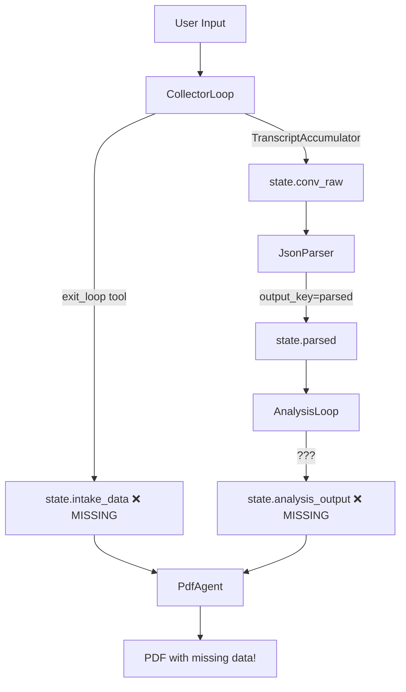

# State Management Analysis & Required Fixes

## Current State Flow Visualization



## Detailed State Requirements

### 1. After CollectorLoop
```json
{
  "conv_raw": [
    {"role": "user", "text": "I felt terrible yesterday"},
    {"role": "assistant", "text": "I hear you had a difficult day. Can you tell me more about what happened?"},
    {"role": "user", "text": "My boss criticized my presentation in front of everyone"},
    {"role": "assistant", "text": "That sounds really uncomfortable. What thoughts went through your mind when that happened?"},
    {"role": "user", "text": "I thought 'Everyone thinks I'm incompetent'"},
    {"role": "assistant", "text": "And how did that thought make you feel?"},
    {"role": "user", "text": "Ashamed and anxious, about an 8 out of 10"}
  ],
  "collection_complete": true,
  "intake_data": {
    "trigger_situation": "Boss criticized presentation in front of colleagues",
    "automatic_thought": "Everyone thinks I'm incompetent",
    "emotion": "shame",
    "intensity": 8
  }
}
```

### 2. After JsonParser
```json
{
  // ... previous state ...
  "parsed": {
    "trigger_situation": "Boss criticized presentation in front of colleagues",
    "automatic_thought": "Everyone thinks I'm incompetent",
    "emotion": "shame",
    "intensity": 8
  }
}
```

### 3. After AnalysisLoop
```json
{
  // ... previous state ...
  "analysis_done": true,
  "analysis_output": {
    "distortions": ["MW", "OG"],
    "distortion_names": ["Mind Reading", "Overgeneralization"],
    "balanced_thought": "My boss gave feedback on one presentation. I don't actually know what everyone thinks, and one critique doesn't define my competence.",
    "micro_action": "List 3 presentations that went well this year",
    "certainty_before": 85,
    "certainty_after": 45
  }
}
```

### 4. PdfAgent Requirements
```python
# Currently expects:
intake_data = state.get("intake_data", {})  # Will be empty!
analysis_output = state.get("analysis_output", "")  # Will be empty!

# PDF will generate with missing content
```

## Root Causes & Solutions

### Problem 1: Exit Loop Tool Doesn't Set State
**File**: `app/tools/exit_loop.py`
```python
# Current:
def exit_loop(collected_data: str = ""):
    """Señal para que LoopAgent termine sus iteraciones."""
    return {"exit": True, "data": collected_data}

# Needed:
def exit_loop(
    trigger_situation: str,
    automatic_thought: str,
    emotion: str,
    intensity: int,
    ctx: Context  # Need access to context
):
    """Señal para que LoopAgent termine sus iteraciones."""
    # Set intake_data in state
    ctx.state["intake_data"] = {
        "trigger_situation": trigger_situation,
        "automatic_thought": automatic_thought,
        "emotion": emotion,
        "intensity": intensity
    }
    ctx.state["collection_complete"] = True
    return {"exit": True}
```

### Problem 2: JsonParser Can't Access conv_raw
**Issue**: LlmAgent instruction templates can reference state variables using `${variable}` syntax
**Solution**: Prompt must include `${conv_raw}` to access conversation

### Problem 3: AnalysisLoop Has No Output Mechanism
**Options**:
1. Use a custom tool to set state
2. Configure output_key (but that overwrites, doesn't append)
3. Use after_agent_callback to process and save results

**Recommended Solution**: Create `SetAnalysisOutputTool`
```python
# app/tools/set_analysis_output.py
def set_analysis_output(
    distortions: list[str],
    balanced_thought: str,
    micro_action: str,
    certainty_before: int,
    certainty_after: int,
    ctx: Context
):
    """Save analysis results to state."""
    ctx.state["analysis_output"] = {
        "distortions": distortions,
        "balanced_thought": balanced_thought,
        "micro_action": micro_action,
        "certainty_before": certainty_before,
        "certainty_after": certainty_after
    }
    ctx.state["analysis_done"] = True
    return {"saved": True}
```

## Testing State Flow

### Create Test Script
```python
# test_state_flow.py
from app.agents.root import root_agent

# Mock a conversation
test_state = {
    "conv_raw": [
        {"role": "user", "text": "I had a panic attack at the store"},
        {"role": "assistant", "text": "What thoughts were going through your mind?"},
        {"role": "user", "text": "Everyone is staring at me and judging me"},
    ]
}

# Test each agent individually
# 1. Test parser can read conv_raw
# 2. Test analysis can read parsed
# 3. Test PDF can read both intake_data and analysis_output
```

## Priority Fixes

1. **CRITICAL**: Modify exit_loop tool to set intake_data
2. **CRITICAL**: Create set_analysis_output tool for AnalysisLoop
3. **CRITICAL**: Update prompts to reference state variables correctly
4. **HIGH**: Add state validation in each agent
5. **MEDIUM**: Add debug logging for state transitions